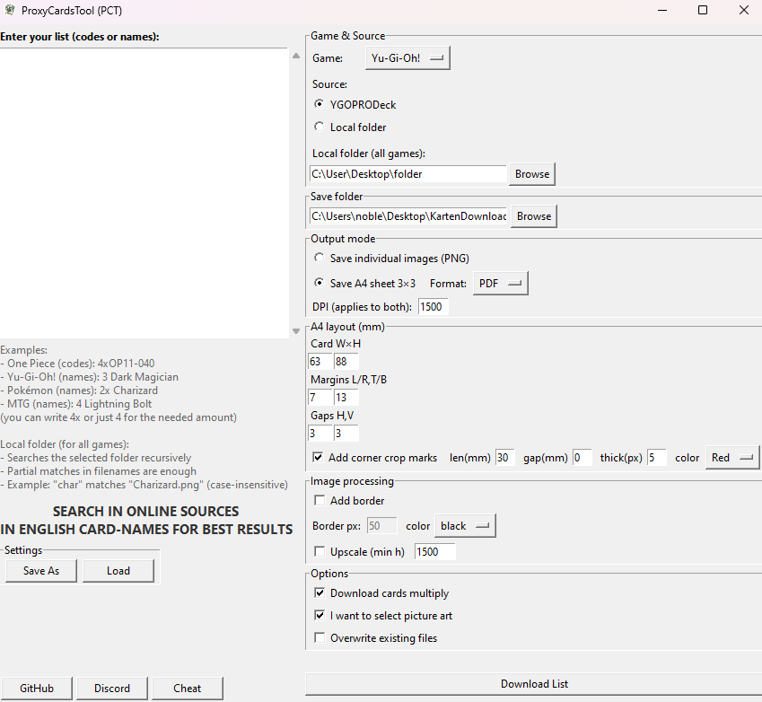

ProxyCardsTool – README
=======================

⚠️ Notes
- This tool is intended for personal use/prototyping. Respect copyrights and each data provider’s
  terms. Do not publish generated images if that would infringe rights.
- All trademarks/artwork belong to their respective owners.

-----------
1) *Features*

- Multiple games:
  • Pokémon 
  • Yu‑Gi‑Oh! 
  • MTG 
  • One Piece 
  
- Search by name (e.g., “Pikachu ex”, “Lightning Bolt”, “Dark Magician”).
  For One Piece, prefer set codes like “OP11-040”.
- Optional: art selection (shows a gallery when multiple candidates exist).
- Export as individual PNGs **or** as A4 3×3 sheets (PDF/PNG, selectable DPI).
- Crop marks (length/gap/thickness/color), border (color/width), upscale to a minimum height.
- Save settings to file (“Save As”) and load them back (“Load”).

-------------
2) *How to run*

Download the .exe from Releases and run it in a separate folder.

--------------------
3) *Quick usage guide*

A) Enter list (left)
   - One card per line. Quantities are optional:
       4x Pikachu ex
       4 Pikachu ex
       Pikachu ex
   - For One Piece, set codes work best, e.g.: 4x OP11-040

B) *Choose Game & Source (right)*
   - Pokémon
   - Yu‑Gi‑Oh! 
   - MTG
   - One Piece 

C) *Folders*
   - __Local folder (all games)__: 	base directory to search images recursively.
   - __Save folder__: where PNGs/sheets are written.

D) Output mode
   - “Save individual images (PNG)” or “Save A4 sheet 3×3” (format: PDF/PNG).

E) A4 layout (mm)
   - Card width/height, page margins, horizontal/vertical gaps.
   - Crop marks: length/gap/thickness/color; crop marks sit **under the border** when a border is enabled.

F) Image processing
   - Border: pixel width + color (white/black).
   - Upscale: resizes images to at least the given height (e.g., 1500 px).

G) Options
   - Download cards multiply: uses per‑line quantities.
   - I want to select picture art: opens a gallery if multiple results exist.
   - Overwrite existing files: otherwise a numeric suffix is added.

H) Settings
   - Save As: export current settings to .json.
   - Load: import settings from .json.

------------------------------

5) Tips & performance

- Disable “Choose art” if you want to process many cards quickly.
- Keep DPI only as high as needed for A4 sheets; higher DPI → larger files → longer saves.
- Use upscale sparingly—it can noticeably slow down processing.
- For One Piece, local mode is recommended (prepare files in a folder with sensible names).

------------------
6) Troubleshooting

- “No images found…”
  • Check spelling (English card names often help). For One Piece, prefer set codes.

--------------------
7) Known limitations

- Websites can change (markup/anti‑bot), which may require small code updates.

